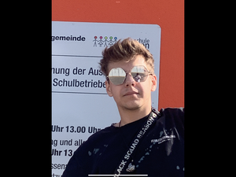

+++
title = "SocialMedia Detox"
date = "2025-02-28"
draft = true
pinned = false
+++
# Selbstwarnehmung mit Social Media Detox


Dieses Interview beschreibt die Erfahrungen eines jungen Mannes, der bewusst einen Digital Detox durchgeführt hat. Es geht um seine Beweggründe, die Herausforderungen während dieser Zeit und die Veränderungen, die er dadurch in seinem Alltag und seiner Selbstwahrnehmung erfahren hat. Besonders betont wird, wie sich sein Selbstbild ohne den ständigen Einfluss von Social Media entwickelt hat und welche positiven Auswirkungen die digitale Abstinenz auf seine Identität hatte. 


Es war ein sonniger Samstagnachmittag, mit klarem Himmel und einem schönen Ausblick auf das angrenzende Feld des benachbarten Bauern. Wir sassen bei mir im Vorgarten, umgeben von Rasen, der am Rand des Grundstücks durch Gebüsche und einen Nadelbaum von einem Feldweg getrennt wurde. Drei Raubvögel kreisten über dem dahinterligenden Feld und warteten auf ihre Beute. Wir sassen an einem braun-schwarzen Aussentisch aus Metall. Die frische Brise schweifte uns nur leicht, deshalb spürte man kaum etwas. Meine Katze lag gegenüber von uns auf einem Kasten und schaute entspannt dem glasklaren Himmel entgegen. Das Rascheln der Blätter und Gebüsche wirkte beruhigend und das Schnurren der Katze trug ebenfalls zur entspannten Athmosphäre bei.Es war ein sonniger Samstagnachmittag, mit klarem Himmel und einem schönen Ausblick auf das angrenzende Feld des benachbarten Bauern. Wir sassen bei mir im Vorgarten, umgeben von Rasen, der am Rand des Grundstücks durch Gebüsche und einen Nadelbaum von einem Feldweg getrennt wurde. Drei Raubvögel kreisten über dem dahinterligenden Feld und warteten auf ihre Beute. Wir sassen an einem braun-schwarzen Aussentisch aus Metall. Die frische Brise schweifte uns nur leicht, deshalb spürte man kaum etwas. Meine Katze lag gegenüber von uns auf einem Kasten und schaute entspannt dem glasklaren Himmel entgegen. Das Rascheln der Blätter und Gebüsche wirkte beruhigend und das Schnurren der Katze trug ebenfalls zur entspannten Athmosphäre bei.


Dieser junge Mann heisst Esra Blaser. Er ist 18 Jahre alt und ist in der Ausbildung zum Applikationsentwickler. Sein Wohnort ist Rüdtlingen-Kirchberg, er wohnt dort vis-à-vis von Aefligen. Sein Interesse gilt der Astrologie und der Informatik, insbesondere der KI. Er hat einen Social-Media-Detox durchgeführt und berichtet von seinen Erfahrungen in dieser Zeit.


> * > 